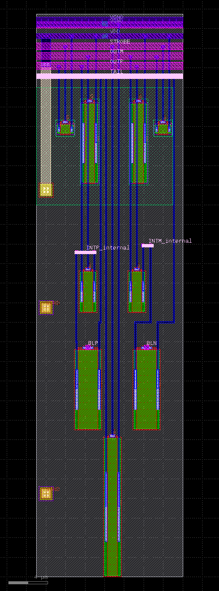
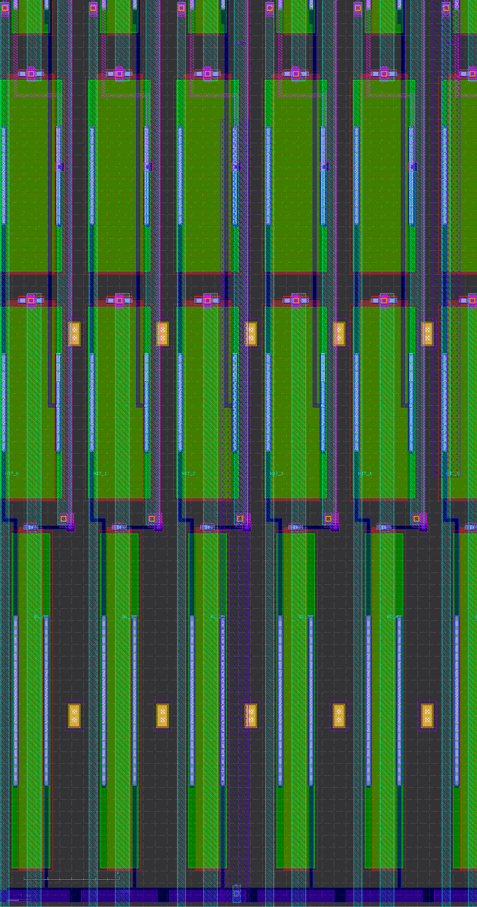

# LVS root cause: custom sense-macro pin binding

Every LVS failure in `cirom_chip_analog`, across all three sense architectures
(strongarm → sa_se → bands), traces to **one root cause: a custom sense
macro's pins do not bind to the chip nets in Magic's extraction.** No
geometric tuning fixes it; the fix is in how the macro is built and extracted.

## What the sign-off checks verify
- **DRC**: geometry is manufacturable (spacing/width/enclosure/grid). KLayout
  `sky130A_mr.drc` is authoritative; Magic's count differs (deck over-approximation).
- **LVS**: the netlist extracted from the layout matches the schematic (same
  devices + connectivity). This is the blocked check.
- **PDN**: every macro/cell power pin actually connects to the VDD/VGND grid.

## The mechanism

A custom macro is extracted one of two ways:

- **Abstract** (`MAGIC_EXT_ABSTRACT_CELLS`): Magic treats the macro as a black
  box and reads only its pin labels. If the pins aren't presented cleanly, the
  chip routing does not bind to them and they extract disconnected.
- **Flat**: the macro's geometry is extracted in full. Pin labels on the metal
  **PIN datatype (X/16)** are read as ports; labels on the text datatype (X/5)
  are not.

### Abstract macros fail (strongarm, sa_se)
The strongarm presents its pins as **full-width met2/met4 strips stacked ~1 µm
apart** at the top of the cell. In abstract extraction these collapse together:
`OUTP`, `OUTM`, `STROBE`, `VDD` all merge onto `VGND`.



> Evidence (`eco_flow5`, the LVS-15 baseline): each SA extracts as
> `X… VGND VGND VGND VGND …/BLP …/BLN VGND strongarm`: 4 of 7 pins are VGND.

`sa_se` (Option A) is also abstract; its narrow pins are labelled on datatype 5,
so they aren't read as ports at all. Same class of failure (~LVS 19).

### Flat macro binds (the band: solved)
The band is 16 `sa_se` cells tiled into one **flat-extracted** macro. Two changes
make its pins bind: (1) pin labels on the **PIN datatype 16**, and (2) **met3
risers** that carry each buried pin out to the macro boundary so the router can
reach it.



> Evidence (`bandsR16`): the band extracts as
> `.subckt sa_se_band16 VGND VDD HIT_0 BL_0 … STROBE_15`: all 64 signal pins +
> power, all 144 devices connected and matched uniquely.

## Issue map

```
Custom sense-macro PIN BINDING  --  the single root of every LVS failure
|
+- ABSTRACT extraction  -->  pins DON'T bind   (stuck for weeks)
|   +- strongarm : full-width met2/met4 pins stacked ~1um  -> OUTP/OUTM/STROBE/VDD collapse to VGND   (LVS 15)
|   +- sa_se A   : narrow pins on datatype-5 (text)         -> not read as ports                       (LVS 19)
|
+- FLAT extraction (bands)  -->  pins BIND   (solved)
    sa_se tiled + labels on PIN datatype 16 + risers to the boundary
    +- signals : extract + connect + match
    +- remaining:
        +- array power : pdngen did not reach the array met4 (PDN-config; connected in the baseline PDN)
        +- array VGND  : logical pin -- bitcell sources tie to the pwell substrate, a separate net
                          from the VGND strap -> needs a pwell tap so strap = substrate = VGND
```

## Outcome: "Circuits match uniquely"
The full chip passes netgen LVS with zero errors. Getting there required
flat-extracting the array against a generated transistor schematic, which
exposed and fixed real silicon bugs the abstract flow had been masking:
- **Floating bitcell sources**: the source pad was never wired (a documented
  deferral); no BL discharge path. Fixed with a per-column li strap network
  tied to the body taps and substrate taps under the VGND rail
  (sources = pwell = VGND, one extracted net).
- **Silent BLP/BLN short**: the w=+1 mask-programming via stack ended exactly
  on the cell boundary and abutted the neighbor's w=−1 jog; Magic merges
  touching tiles, so DRC could never flag it. Every even row shorted
  BLP_c to BLN_c+1. Fixed by moving the stack west and putting the w=−1
  via2 directly under a locally widened BL− strip.
- **Label-only nwell tie**: the precharge nwell was tied to VPWR by a label,
  which splits under the chip flow's `extract unique`. Fixed with a real
  li + viali connection into the rail.
- **Array VPWR to the chip grid**: pdngen never vias parallel met4/met5
  overlaps, so the macro carries its own met5 pads + via4 on a widened VPWR
  strip, placed so the chip met5 stripe passes over and merges (the pads are
  kept out of the LEF entirely).
- Known deferred: the 32 precharge pull-up gates are floating in layout
  (modeled as dangling in the schematic; functional fix = gate-contact rework).
- **Signoff complete: KLayout DRC 0 + LVS 0** (run bands_eco4) -- the riser
  field was closed by band-internal fixes, a full moated met3 OBS,
  poke-proof riser geometry, and same-net ECO fills at StreamOut (see
  drc_failed_attempts.md for the full recipe). Magic's ~12 k remains the
  known deck discrepancy, not authoritative.

## Regenerate the figures
`tools/render_cell.py` renders any GDS region through KLayout with the
PDK layer colours (note: KLayout's `save_image_with_options` monochrome
flag must stay false). The band pin figure is a crop from the signoff
build; the signal-pin geometry is unchanged since (later band fixes
were FEOL-only), and the current full band render lives under
`figures/band/`. The strongarm figure is historical; its source macro
is intentionally retired, so it is not regenerated.

## Post-signoff addendum

The band's pins bind and the chip signs off; but transistor-level LVS
of the band itself (added later, during the TinyTapeout 4-SA work)
caught a band-assembly defect invisible to every check above: the
builder's nwell-merge strip overlapped the latch nfets' diffusion,
shorting each comparator's internal nodes into the well/VDD network.
Chip-level LVS cannot see it because the band is abstract here. The fix
and the lesson (flat-extract every hand-assembled macro against its own
schematic) are recorded in the band build, and band standalone LVS is
now part of the stack rebuild.

## Second post-signoff addendum: band-level paint and the substrate port

Two later findings extend the lesson, both from the TinyTapeout tile
generation of the band:

- **Band-level paint over SA-internal geometry is DRC-legal and
  LVS-fatal.** A latch-up tap tie painted at band level landed on li
  that belongs to the SA's HIT output (the assumed VPWR li rail at
  that y does not exist), merging all 16 HIT ports into VDD: every
  comparator output stuck high. KLayout DRC cannot flag it (shorts
  are legal geometry) and the band build published without netgen.
  The fix routes the tap tie through the one li/met1/met2-free
  inter-SA lane (x 3.15..3.75) on met1 into the VDD met2 rail, and
  the band build now refuses to publish unless band4 + band16 netgen
  both "match uniquely" (plus KLayout DRC 0). The escape survived one
  full tile hardening because its LVS signature ("no matching pin"
  on every HIT) was misread as the known export-label class:
  classify every LVS mismatch to a named net before dispositioning.
- **The residual tile LVS class is the band's substrate port.** The
  band carries no substrate taps by design (the tile tap network
  ties psub to VGND), so tile-level extraction exports the band's
  p-substrate as an anonymous port (`a_*#`, nfet bulks) that lands
  on VGND. The schematic band has no substrate port, so netgen
  reports a pin mismatch and a net-count off-by-one. Verified on the
  shipped GDS: devices equal, all signal ports bound, the anonymous
  port's net is the substrate node, its top-level net is VGND.

## Related
- `drc_failed_attempts.md`: DRC dead-ends (review before any DRC change).
